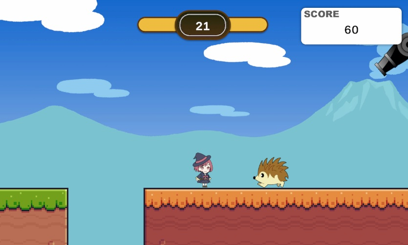

# JewelryHunter_Unity6
  
[ゲームのサンプルプレイ](https://hoshino-moz.github.io/JewelryHunter_Web/)



## 訓練校で学習する初2D作品
* playerの動作
* アニメーションの作り方
* タグやレイヤーの使い方
など基本を学んでいます。

## 制作のポイント
### アニメーションをトランジションで作成
Playerのアニメ切り替えには各クリップをトランジションでつないでフラグで管理しました。トランジションを組み込むことで、アニメ切り替えが滑らかにしています。
  

  
## Itemのコーディングの効率化
Itemは列挙型のItemColorを自作して、ItemColor型の変数次第で何色かを指定する
  
  

```c#
using UnityEngine;

public enum ItemColor
{
    White,
    Blue,
    Green,
    Red
}

public class ItemData : MonoBehaviour
{
    public ItemColor colors = ItemColor.White;
    public Sprite[] itemSprites;

    public int value = 0;       // 整数値を設定できる

    void Start()
    {        
        SpriteRenderer spriteRenderer = GetComponent<SpriteRenderer>();

        switch (colors)
        {
            case ItemColor.White:
                spriteRenderer.sprite = itemSprites[0];
                break;
            case ItemColor.Blue:
                spriteRenderer.sprite = itemSprites[1];
                break;
            case ItemColor.Green:
                spriteRenderer.sprite = itemSprites[2];
                break;
            case ItemColor.Red:
                spriteRenderer.sprite = itemSprites[3];
                break;
        }
    }
}
```

## TextMeshProのデザインの切り分け
TextMeshProのデザインを細かく切り分けして
データを用意するなど工夫をした

